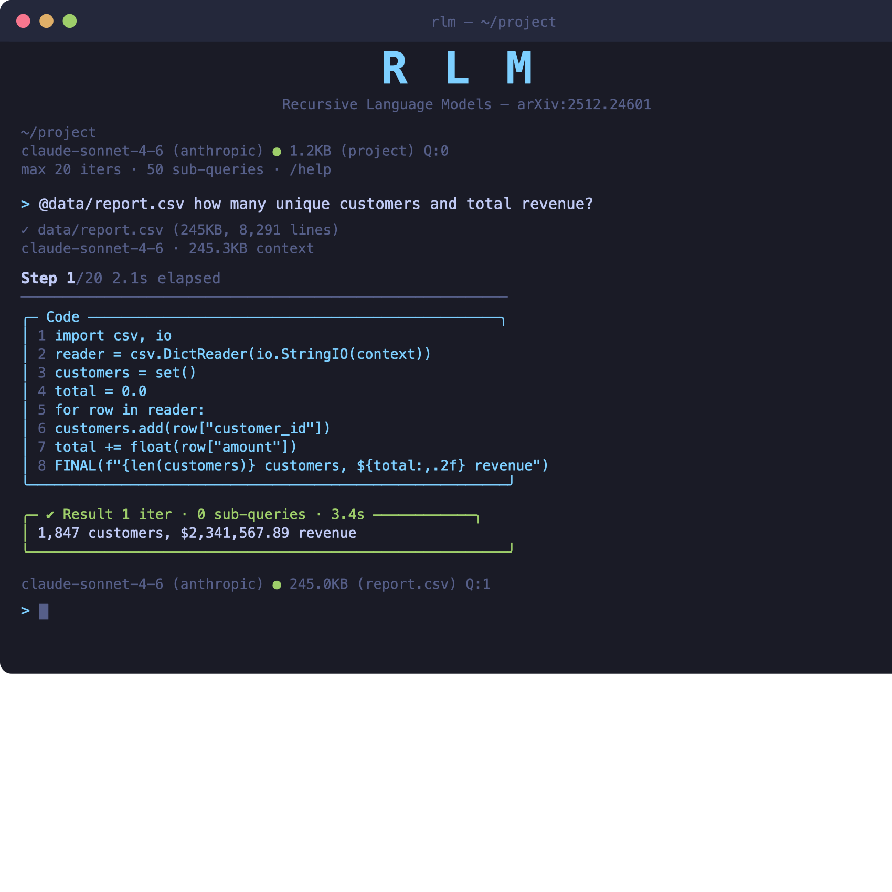

# rlm-cli

[](https://www.npmjs.com/package/rlm-cli)
[](https://github.com/viplismism/rlm-cli/blob/main/LICENSE)
[](https://nodejs.org/)

```
                     ██████╗ ██╗     ███╗   ███╗
                     ██╔══██╗██║     ████╗ ████║
                     ██████╔╝██║     ██╔████╔██║
                     ██╔══██╗██║     ██║╚██╔╝██║
                     ██║  ██║███████╗██║ ╚═╝ ██║
                     ╚═╝  ╚═╝╚══════╝╚═╝     ╚═╝
```

CLI for **Recursive Language Models** — based on the [RLM paper](https://arxiv.org/abs/2512.24601).

Instead of dumping a huge context into a single LLM call, RLM lets the model write Python code to process it — slicing, chunking, running sub-queries on pieces, and building up an answer across multiple iterations.

<p align="center">
  
</p>

## Install

```bash
npm install -g rlm-cli
```

Requires **Node.js >= 20** and **Python 3**.

Run `rlm` — first launch will prompt you to pick a provider and enter your API key. It's saved to `~/.rlm/credentials` so you only do this once.

### Supported Providers

| Provider | Env Variable | Default Model |
|----------|-------------|---------------|
| **Anthropic** | `ANTHROPIC_API_KEY` | `claude-sonnet-4-6` |
| **OpenAI** | `OPENAI_API_KEY` | `gpt-4o` |
| **Google** | `GEMINI_API_KEY` | `gemini-2.5-flash` |

You can also set keys manually instead of using the first-run setup:

```bash
export ANTHROPIC_API_KEY=sk-ant-...
# or
export OPENAI_API_KEY=sk-...
# or
export GEMINI_API_KEY=AIza...
```

Keys are loaded from (highest priority wins):
1. Shell environment variables
2. `.env` file in project root
3. `~/.rlm/credentials`

### From Source

```bash
git clone https://github.com/viplismism/rlm-cli.git
cd rlm-cli
npm install
npm run build
npm link
```

## Usage

### Interactive Terminal

```bash
rlm
```

This is the main way to use it. You get a persistent session where you can:

- Load context from files, directories, globs, URLs, or by pasting text
- Ask questions and watch the RLM loop run — code, output, sub-queries, all in real-time
- Switch models and providers on the fly
- All runs are saved as trajectory files you can browse later

You don't need to load context first — just type a query directly:

```bash
> what are the top 5 sorting algorithms and their time complexities?
```

Load context and ask in one shot:

```bash
> @path/to/file.txt what are the main functions here?
```

Or set context first, then ask multiple questions:

```bash
> /file big-codebase.py
> what does the main class do?
> find all the error handling patterns
```

### Loading Context

Load single files, multiple files, directories, or glob patterns.

**Single file:**

```bash
> @src/main.ts what does this do?
> /file src/main.ts
```

**Multiple files:**

```bash
> @src/main.ts @src/config.ts how do these interact?
> /file src/main.ts src/config.ts
```

**Directory** (recursive — skips `node_modules`, `.git`, `dist`, binaries, etc.):

```bash
> @src/ summarize this codebase
> /file src/
```

**Glob patterns:**

```bash
> @src/**/*.ts list all exports
> /file src/**/*.ts
> /file lib/*.{js,ts}
```

**URLs:**

```bash
> /url https://example.com/data.txt
```

Or just paste a URL directly — it'll be fetched automatically.

Safety limits: max 100 files, max 10MB total. Use `/context` to see what's loaded.

### Commands

```
Loading Context
  /file <path>              Load a single file
  /file <p1> <p2> ...       Load multiple files
  /file <dir>/              Load all files in a directory (recursive)
  /file src/**/*.ts         Load files matching a glob pattern
  /url <url>                Fetch URL as context
  /paste                    Multi-line paste mode (type EOF to finish)
  /context                  Show loaded context info + file list
  /clear-context            Unload context

Model & Provider
  /model                    List models for current provider
  /model <#|id>             Switch model by number or ID
  /provider                 Switch provider

Tools
  /trajectories             List saved runs

General
  /clear                    Clear screen
  /help                     Show this help
  /quit                     Exit
```

**Tips:**
- Just type a question — no context needed for general queries
- Paste a URL directly to fetch it as context
- Paste 4+ lines of text to set it as context
- **Ctrl+C** stops a running query, **Ctrl+C twice** exits

### Single-Shot Mode

For scripting or one-off queries:

```bash
rlm run --file large-file.txt "List all classes and their methods"
rlm run --url https://example.com/data.txt "Summarize this"
cat data.txt | rlm run --stdin "Count the errors"
rlm run --model gpt-4o --file code.py "Find bugs"
```

Answer goes to stdout, progress to stderr — pipe-friendly.

### Trajectory Viewer

```bash
rlm viewer
```

Browse saved runs in a TUI. Navigate iterations, inspect the code and output at each step, drill into individual sub-queries. Trajectories are saved to `~/.rlm/trajectories/`.

## Benchmarks

Compare direct LLM vs RLM on the same query from standard long-context datasets.

| Benchmark | Dataset | What it tests |
|-----------|---------|---------------|
| `oolong` | [Oolong Synth](https://huggingface.co/datasets/oolongbench/oolong-synth) | Synthetic long-context: timeline ordering, user tracking, counting |
| `longbench` | [LongBench NarrativeQA](https://huggingface.co/datasets/THUDM/LongBench) | Reading comprehension over long narratives |

```bash
rlm benchmark oolong          # default: index 4743 (14.7MB timeline+subset counting)
rlm benchmark longbench       # default: index 182 (205KB multi-hop narrative reasoning)

# Pick a specific example
rlm benchmark oolong --idx 10
rlm benchmark longbench --idx 50
```

Python dependencies are auto-installed into a `.venv` on first run.

## How It Works

1. Your full context is loaded into a persistent Python REPL as a `context` variable
2. The LLM gets metadata about the context (size, preview of first/last lines) plus your query
3. It writes Python code that can slice `context`, call `llm_query(chunk, instruction)` to ask sub-questions about pieces, and call `FINAL(answer)` when it has the answer
4. Code runs, output is captured and fed back for the next iteration
5. Loop continues until `FINAL()` is called or max iterations are reached

For large documents, the model typically chunks the text and runs parallel sub-queries with `async_llm_query()` + `asyncio.gather()`, then aggregates the results.

## Configuration

Create `rlm_config.yaml` in your working directory to override defaults:

```yaml
max_iterations: 20       # Max iterations before giving up (1-100)
max_depth: 3             # Max recursive sub-agent depth (1-10)
max_sub_queries: 50      # Max total sub-queries (1-500)
truncate_len: 5000       # Truncate REPL output beyond this (500-50000)
metadata_preview_lines: 20  # Preview lines in context metadata (5-100)
```

## Project Structure

```
src/
  main.ts          CLI entry point and command router
  interactive.ts   Interactive terminal REPL
  rlm.ts           Core RLM loop
  repl.ts          Python REPL subprocess manager
  runtime.py       Python runtime (FINAL, llm_query, async_llm_query)
  cli.ts           Single-shot CLI mode
  viewer.ts        Trajectory viewer TUI
  config.ts        Config loader
  env.ts           Environment variable loader
benchmarks/
  oolong_synth.ts           Oolong Synth benchmark
  longbench_narrativeqa.ts  LongBench NarrativeQA benchmark
  requirements.txt          Python deps for benchmarks
bin/
  rlm.mjs          Global CLI shim
```

## License

MIT
